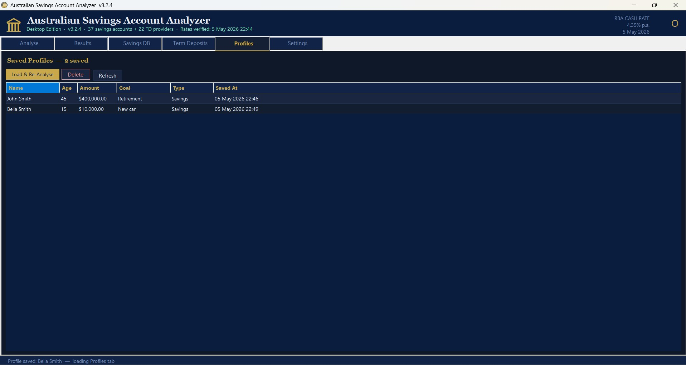
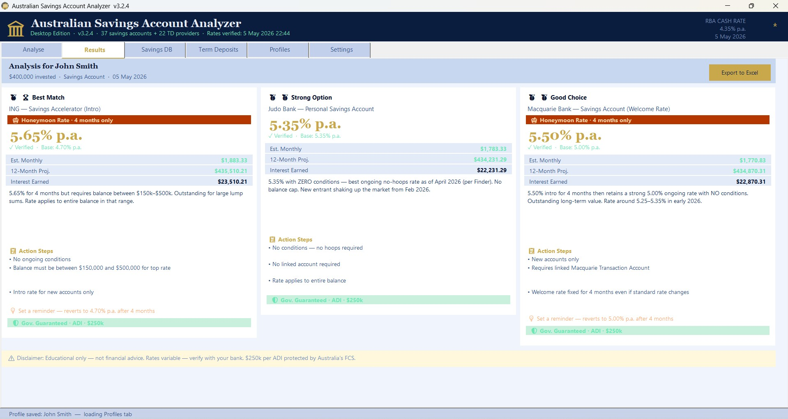
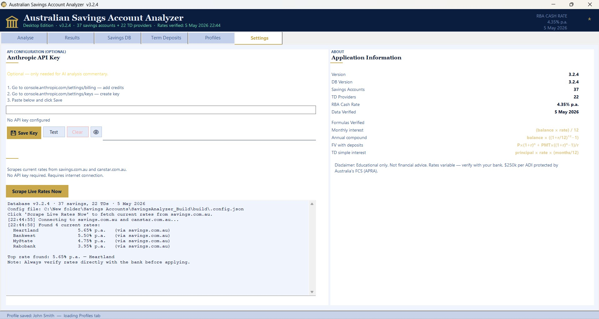

# Australian Savings Analyzer
A clean, modern tool for analysing **Australian savings growth**, **interest rates**, and **compound returns**.  
Designed for individuals and financial planners who want fast, accurate projections.

  <a href="https://github.com/smanifold123/Australian-Savings-Analyzer/releases/latest"
     style="padding:12px 20px;background:#0366d6;color:white;border-radius:6px;text-decoration:none;font-size:16px;">
    ⬇️ Download Latest Release
  </a>

---

## ⭐ Features

### 📈 Savings Growth Calculator
- Daily, monthly, and annual compounding  
- Custom deposit schedules  
- Variable interest rates  
- Inflation‑adjusted projections  

### 💰 Australian‑Specific Settings
- APRA‑aligned interest assumptions  
- Australian inflation presets  
- Tax‑aware savings modelling (optional)  

### 📊 Visual Analysis
- Growth curves  
- Contribution vs. interest breakdown  
- Year‑by‑year tables  
- Exportable charts  

### 🧮 Scenario Comparison
- Compare multiple savings strategies  
- Side‑by‑side projections  
- Best‑case / worst‑case modelling  

---

## 🖼️ Screenshot Gallery

### Landing Page

### Profiles

### Results

### Settings

### Term Deposit

### Youth Example

---

## 📚 Documentation
- [Installation Guide](install.md)  
- [Feature Overview](features.md)  

---

## 🛠️ Tech Stack
- PowerShell / .NET  
- WPF (if GUI) or CLI  
- Australian financial datasets (optional)

---

## 📄 License
GPL‑3.0 — see the [LICENSE](../LICENSE) file.
